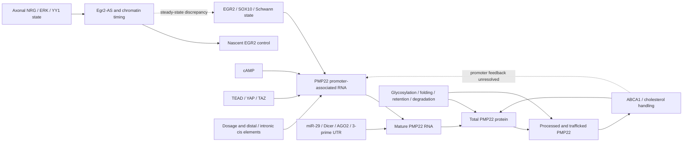

Question **q_277f20df4b6b47cc** — continuation of the existing PMP22 investigation. This is a bounded evidence map, not a claim that the full regulatory system is known. Earlier analyses remain in `REPORT.inherited.md`, `preservation.json`, and the initial/r002/r003 network snapshots. New work below is distinguished from inherited measurements. All paths are relative to this question directory unless stated otherwise.

PMP22 regulation is a coupled system: copy number and cis elements set the transcriptional capacity; Schwann-cell state and transcription-factor activity select promoter/enhancer use; RNA processing and miRNA/RISC regulate mature RNA and translation; folding, glycosylation, retention, degradation and trafficking determine how much functional protein reaches myelin. PMP22 also changes lipid handling and cell state, so some associations run outward from PMP22 rather than toward its transcription. These layers cannot be reconstructed from gene-level RNA alone.

| Layer | Evidence-supported components | Important boundary |
|---|---|---|
| Cis architecture | P1/exon1A and P2/exon1B transcripts, distal and intronic enhancers; endogenous mouse enhancer deletion | Both promoters encode the same protein. Gene counts and unvalidated microarray probes do not identify promoter use. |
| Schwann transcriptional state | SOX10, EGR2, cAMP-responsive TSS abundance; TEAD with YAP/TAZ | Direct cis effects coexist with differentiation effects. Quantitative EGR2 mediation is not identified. |
| Upstream timing | NRG–ERK–YY1 state; Egr2-AS, AGO/EZH2-associated repression; later WDR5/C-JUN chromatin branch | NRG isoform, phosphorylation, time after injury and assay endpoint matter. YY1/ERK RNA does not measure activity. |
| RNA regulation | miR-29/3′UTR-site effects, Dicer and AGO2-associated repression; G3BP1-sensitive RNA abundance in a different cell type | Binding or RNA increase alone does not establish altered decay. Endogenous AGO loading across injury remains unmeasured here. |
| Protein disposition | N-glycosylation, OST complexes, UGGT1/calnexin, ERAD/retention and trafficking | WT dosage and folding mutants are different perturbations. Co-IP enrichment is not total abundance or functional necessity. |
| Context-specific route | RUNX1/3–PMP22 cis/promoter regulation in NF1-deficient mouse tumors | Tumor, sorted-cell and normal myelination contexts cannot be pooled. |
| Feedback/consequences | PMP22–ABCA1/cholesterol handling; reciprocal protein abnormalities after ABCA1 loss | Reciprocal protein change does not prove a cholesterol-to-PMP22 promoter feedback mechanism. |

This overview separates regulatory layers; arrows summarize context-dependent relationships, not universal signs or effect sizes. Dashed links remain unresolved. The complete evidence/status network is `outputs/mechanisms.json`.

Primary cis sources are [EGR2/SOX10 distal enhancers](https://pmc.ncbi.nlm.nih.gov/articles/PMC3298281/), [endogenous enhancer deletion](https://pmc.ncbi.nlm.nih.gov/articles/PMC7322568/), and [TEAD/YAP/TAZ](https://pmc.ncbi.nlm.nih.gov/articles/PMC5181599/). Complete native HTML is preserved in `inputs/continuation/`; the source passages and endpoint audit are in `outputs/audited-source-passages.json` and `outputs/assay-endpoint-audit.tsv`. The mouse enhancer effect varies with age and promoter; it is not an all-or-none switch. The TEAD experiments include human hg18 enhancer sequences tested in rodent cells. At P20, a Pmp22 Prom1 reduction without a statistically significant Egr2 RNA change supports an additional route, but absence of significance does not demonstrate absence of mediation. No matched EGR2 rescue/clamp is present in the inspected study.

Inherited promoter evidence is retained: GSE139321 Tn5Prime identifies cAMP-responsive and SOX10-dependent rat Pmp22 TSS clusters, notably 5439/5446, within a selected 4,993-TSS universe. It is a 5′-RNA endpoint, not a direct nascent-transcription measurement; the rn5 experiment is not merged with rn6 Egr2-AS chromatin data. Alternate workbook encodings are not independent experiments.

The Egr2-AS discrepancy remains real at the deposited steady-state RNA endpoint. The new full-transcriptome analysis reused the exact source-preserving Parquet derivation and independently downloaded the count gzip; decompressed bytes match the inherited source SHA256 exactly. After excluding the embedded repeated header, there are 17,949 numeric genes. The AS/GFP normalized ratios remain **Egr2 1.258, Jun 0.820, Pmp22 0.885**. Every AS-versus-GFP sample pairing has the same Egr2 and Jun direction, and CPM agrees. Source labels and the internal header provide no evidence to invert the groups. GEO describes GSNAP alignment while the paper says HISAT2; that provenance discrepancy remains unresolved. Two libraries per condition are not assumed to be independent animals or pools, and no new differential-expression p-values were manufactured.

The broad analysis exposed information missed by the inherited candidate panel. Seven globin features dominate the largest average increases. A refined ten-gene hemoglobin selector gives counts of **953, 259,574, 620, 462** in AS1, AS2, GFP1, GFP2: principally an AS2 signal, about 0.35% of that library. It lacks a coherent accompanying erythroid program in the examined markers; this cannot diagnose contamination, vector sequence or mapping origin. Removing those genes from the normalization calculation leaves the target ratios essentially unchanged. AS libraries are less mutually correlated than GFP libraries, and PCA on 11,573 sufficiently expressed genes shows substantial between-AS variation. The full feature table, sample correlations, PCA and ranked extremes—not just a preselected panel—are saved. `rna-globin-*` is an earlier broad substring exploration that included non-hemoglobin names; the refined, registered `rna-hemoglobin-*` outputs support the reported totals.

Reading the original [2017 Egr2-AS paper](https://pmc.ncbi.nlm.nih.gov/articles/PMC5800313/) narrows the interpretation without resolving it. It measures nascent Egr2 by nuclear run-on, mouse myelinated DRG cultures, and an injury timecourse. The source reports an approximately 38-fold Egr2 RNA response to antisense inhibition at six hours after injury, no difference at 24 hours, and about threefold at 48 hours. Those are published summaries, not new replicate-level estimates. Chromatin-complex composition also changes over time. The authors explicitly distinguish regulation of induction timing from steady-state expression. NRG type III acutely suppresses the antisense RNA; type I has a delayed response. The YY1 Ser184 experiments concern protein state and RNA association.

The [2024 paper](https://pmc.ncbi.nlm.nih.gov/articles/PMC11592338/) and its newly recovered native supplement instead show EGR2 protein down and C-JUN protein/activity up in their presented assays. The supplement's bars and IGV panels were inspected, not treated as a downloadable count matrix or digitized as new biological replicates. The RNA-seq is primary rat Schwann culture at 48 hours with forskolin/heregulin; it is not matched to the original mouse injury experiment. Crucially, the deposited libraries are not mapped to the same cultures as the protein/activity measurements. Timing, post-transcriptional compensation, different experimental material, or an unresolved experiment/processing issue remain alternatives. A coherent mechanism does not make the deposited opposite RNA directions disappear.

The new accessibility work has two distinct outcomes. **The Egr2-AS quantitative promoter matrix remains blocked**: GEO has four narrowPeak lists; the superseries also has Hi-C matrices, which are not ATAC counts. The paper describes promoter featureCounts analysis, but the recovered supplement supplies images and the pinned GitHub tree supplies scripts rather than that matrix. Peak absence is still not a measured zero. Detailed evidence is listed in the investigation queue and access-gap records.

**Independent quantitative accessibility was acquired and analyzed** from GSE122776: two processed TDF tracks, normalized to ten million tags according to their embedded metadata. The source establishes mm10; the TDF genome field itself contains a local software path. The ordinary question-local parser reads the unzoomed processed intervals, validates binary structure and excludes unrepresented bases rather than zero-filling. Across 33,105 RefSeq promoter/site windows, 3,288 have at least 90% observed coverage in both tracks. Their median log2 tKO/sKO signal difference is approximately −0.450. At Pmp22, common-base integration gives −0.447, −0.626 and −0.718 for three well-covered promoter windows; the paper's RUNX site is −0.111. Thus the local decrease is not uniquely PMP22-specific. The low-coverage alternative window is reported separately and is not used to assert a whole-promoter increase.

These are descriptive track comparisons: **one library per genotype**, with DRG/tumor annotations and sorted-cell material, not independent differential-accessibility replication. Contemporary RefSeq coordinates are not assumed to be the authors' annotation release or labeled P1/P2 by guesswork. The [RUNX primary paper](https://pmc.ncbi.nlm.nih.gov/articles/PMC6482019/) already reports lower P2-region accessibility alongside higher P1 RNA, so the observed lower signal is not a new contradiction. Bulk RNA and sorted-cell ATAC also have different material. A locus plot is `outputs/runx-Pmp22-accessibility.png`; broad and common-base measurements accompany it.

The follow-up GSE122774 analysis covers **24,062 gene rows** in six bulk RNA libraries. Fresh median-ratio normalization gives Pmp22 **2.308x** (CPM 2.207x), Mpz 2.820x and Mbp 2.475x; all nine cross-group pairwise comparisons retain those increases. Egr2 and Sox10 changes are smaller and their pairwise ratios cross one. This reproduces the approximate published gene-level Pmp22 response, not promoter-specific estimates. Broad rankings and PCA are saved; large immune-associated and other changes reinforce the need to separate tissue composition from within-cell regulation. Nf803/Nf809 and Rx1692/Rx1698 have swapped GEO titles versus filenames/internal headers. These swaps remain within groups, so group means are unchanged; no animal-level RNA/ATAC pairing is justified. The GEO Rx genotype field also omits Nf1, unlike the paper's triple-KO description. See `outputs/runx-rna-sample-audit.tsv` and `outputs/runx-rna-summary.json`.

The underexplored protein branch now has an executed broad analysis. The [PMP22 glycosylation study](https://pmc.ncbi.nlm.nih.gov/articles/PMC8191293/) provides TMT co-IP selected-hit summaries for WT, N41Q and L16P human constructs in HEK293 cells. All **670 selected entries, 515 unique proteins**, were analyzed, with 40 proteins present in all three lists. The source selection is Q<0.1 and mean log2 enrichment>0.2. Unlisted entries are not zeros. Unequal list sizes—56 WT, 485 N41Q, 129 L16P—cannot establish unequal biological interaction breadth because the paper itself identifies batch-dependent detection power.

Among proteins selected in both WT and L16P, large descriptive enrichment differences include LMAN1, TMED9, ERGIC3 and CANX (approximately 0.93, 0.92, 0.85 and 0.84 log2 units). No fresh significance test is justified without channels and covariance. The functional assays are an important counterexample to equating enrichment with regulation: LMAN1 binding did not yield a substantial knockout trafficking effect, whereas UGGT1 had a functional effect despite not appearing in the screen. Source experiments support N-glycosylation-dependent retention and variant-specific trafficking; they do not turn these interactions into endogenous human myelin-protein effect sizes. Four PRIDE processed SEARCH files are approximately 1.18–1.88 GB each, above the 512 MiB per-file limit; the inventory contains no small replicate/channel matrix. No raw MS processing or serialized database execution was attempted.

An independent RNA alternative was also analyzed from [G3BP1 experiments](https://pmc.ncbi.nlm.nih.gov/articles/PMC3866477/). In MCF7 cells, selected expression contrasts show PMP22 RNA induction after G3BP1 loss, but reported RNA half-life means are 4.4 hours in control and 4.2 hours after siG3BP1 (three independent experiments in the source). Other knockdowns are retained in the output. This does not demonstrate stabilization, nor is non-significance an equivalence test. The assay is outside the Schwann context. It is useful precisely because it prevents RNA-binding annotations from being mistaken for a decay mechanism.

The [miR-29 study](https://pmc.ncbi.nlm.nih.gov/articles/PMC2713384/) supplies stronger context-specific post-transcriptional evidence: reporter seed deletion, anti-miR perturbation, endogenous RNA/protein changes and engineered AGO2 association. Growth conditions change Dicer and miRNA abundance. However, developmental samples pool at least two rats, injury assays pool ten nerves, and technical triplicates are not ten independent animals. Endogenous injury-state AGO loading was not measured in the same samples. The source itself has an r-squared discrepancy, 0.78 in Results versus 0.078 in the Figure8 caption; no new correlation is inferred from that inconsistent summary. The [human fibroblast extension](https://pmc.ncbi.nlm.nih.gov/articles/PMC6920087/) measures RNA and protein at different times and uses few donors, so it does not settle a matched human Schwann RNA-to-protein relationship.

New human GSE7423 analysis covers all 43,931 probes, with actual channel audits for PMP22. Twelve arrays represent seven donors; duplicate arrays are technical. **BAR has the duplication, JIM has L16P**—they are not two duplication donors. VALUE is log10 of test Cy3/reference Cy5, not log2. After averaging technical arrays within donor and equally weighting the three normal donors, the two PMP22 probes give BAR/normal ratios of **25.6 and 2.66**, and JIM/normal ratios of **27.4 and 4.86**. Their different magnitudes are retained, not averaged into a dose coefficient or assigned to P1/P2. The primary probe has substantial control signal; the alternative clone probe has lower/less convincing control signal and unresolved sequence specificity. Per-array log-ratio p-values are not genotype differential-expression p-values.

The broad BAR/JIM contrast correlation is 0.812; large data-driven changes include CDH19, GPM6B, PMP2 and S100B. These patterns can reflect common culture/state or disease effects and do not isolate copy number. Nerve origin, culture and donor differences remain confounded, and these are proliferating cultured Schwann cells rather than myelinating nerve. There is no justified formal human dosage effect from one donor per mutation class.

The lipid audit adds a useful correction to a purely outward-only map. [PMP22/ABCA1 experiments](https://pmc.ncbi.nlm.nih.gov/articles/PMC6607759/) support impaired cholesterol efflux and ABCA1 localization after PMP22 loss, but also report increased, abnormally processed PMP22 protein after ABCA1 loss. That is a reciprocal protein-level relationship. The published ABCA1-KO total PMP22 increase is 1.53x while the endo-H-resistant fraction falls from 81.9% to 52.2%. An explicitly illustrative product of those group summaries gives a resistant-pool index of 0.975 relative to WT. It is not a paired estimate, lacks covariance/uncertainty, and does not measure surface/myelin protein; it shows why total abundance should not stand in for processed protein. Exact source paragraphs and arithmetic are preserved in `outputs/lipid-summary-analysis.json`. It does **not** identify a direct lipid-to-PMP22 promoter mechanism; the paper explicitly leaves intermediary pathways unresolved. Hormonal/metabolic control and precise endogenous human promoter regulation remain unfinished frontier branches.

The most consequential restart is a sample-linked Egr2-AS timecourse combining nascent RNA, mature RNA, protein/activity and quantitative accessibility. The current data narrow hypotheses but do not resolve the causal discrepancy. Other concrete next inputs are a small processed TMT channel matrix, independent human genotype-aware promoter/protein measurements, and endogenous miRNA/AGO measurements across state changes. `outputs/investigations.json` retains explicit statuses, artifact IDs, blockers and restart actions; deferred branches are not marked completed.

Reproducibility: ordinary scripts are in `scripts/`, native measurement and primary-source bytes in `inputs/continuation/`, computational registrations in `outputs/continuation-registration.json`, source/interpretation preservation in `outputs/continuation-preservation.json`, and cumulative transport accounting in `inputs/continuation/transport.json`. No downloaded code, workbook formulas, R/pickle objects or raw sequencing/MS pipelines were executed. The question notebook is `LABBOOK.md`. New network revisions preserve all inherited snapshots; the question remains open.
